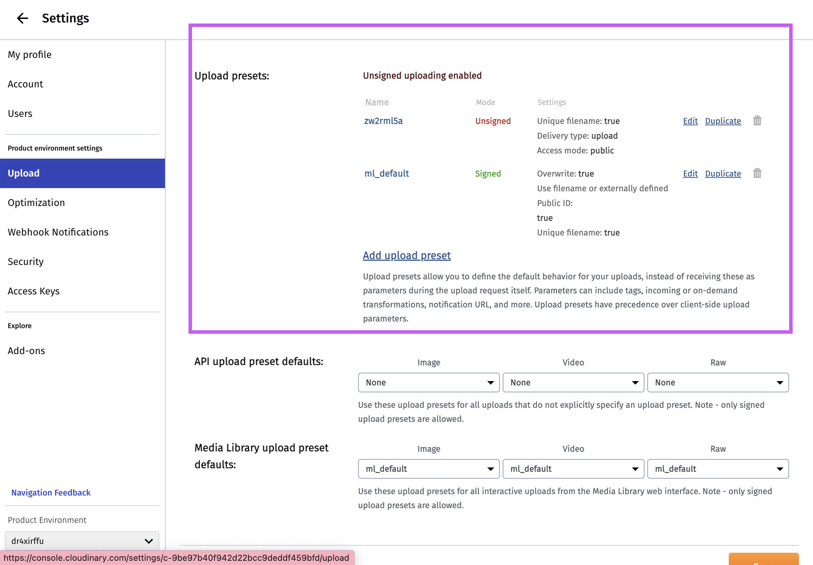
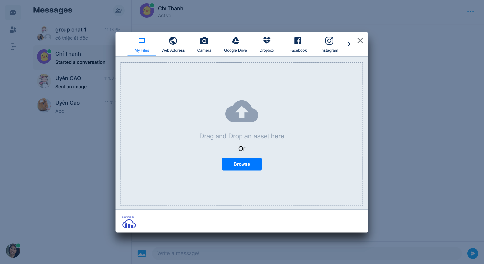

This is a [Next.js](https://nextjs.org/) project bootstrapped with [`create-next-app`](https://github.com/vercel/next.js/tree/canary/packages/create-next-app).

## Getting Started

First, run the development server:

```bash
npm run dev
# or
yarn dev
# or
pnpm dev
```

Open [http://localhost:3000](http://localhost:3000) with your browser to see the result.

You can start editing the page by modifying `app/page.tsx`. The page auto-updates as you edit the file.

This project uses [`next/font`](https://nextjs.org/docs/basic-features/font-optimization) to automatically optimize and load Inter, a custom Google Font.

## Used Technologies

- TypeScript
- ReactJS - NextJS v.13 (js framework) ⭕
- MongoDB (database)
- Prisma (connection with database) ⭕
- Zustand (state management) ⭕
- Pusher - pusherjs (real-time) ⭕
- next-cloudinary (image storage) ⭕
- Tailwind CSS/ react-icons/ react-hot-toast - react-select - react-spinners (stylings)

- clsx - lodash - date-fns
- bcrypt

## Deploy

- [Smoky Messenger Clone](https://smoky-messenger-clone.vercel.app/)

## Prisma

- Setup Prisma in NextJS app (/libs/prismadb.ts)

```javascript
import { PrismaClient } from "@prisma/client";

declare global {
  var prisma: PrismaClient | undefined;
}

const client = globalThis.prisma || new PrismaClient();

if (process.env.NODE_ENV !== "production") globalThis.prisma = client;

export default client;
```

- Sample Prisma Schema Model (/prisma/schema.prisma)

```javascript
generator client {
  provider = "prisma-client-js"
}

datasource db {
  provider = "mongodb"
  url      = env("DATABASE_URL")
}

model User {
  id        Int      @id @default(autoincrement())
  createdAt DateTime @default(now())
  email     String   @unique
  name      String?
}
```

## Next Cloudinary

```javascript
import { CldUploadButton } from "next-cloudinary";
const handleUpload = (result: any) => {
  // image URL: result?.info?.secure_url
  // logic code...
};

<CldUploadButton
  options={{ maxFiles: 1 }}
  onUpload={handleUpload}
  uploadPreset="zw2rml5a"
>
  <Button disabled={isLoading} secondary type="button">
    Change
  </Button>
</CldUploadButton>;
```

uploadPreset là một khái niệm đặc thù của Cloudinary. Nó đại diện cho một tập hợp các thiết lập tải lên được định trước mà bạn có thể tạo và cấu hình trong tài khoản Cloudinary của bạn. Upload preset cho phép bạn xác định và tái sử dụng một tập hợp nhất quán các tùy chọn cho việc tải lên các tệp tin khác nhau, giúp đơn giản hóa quy trình chỉ định cài đặt tải lên mỗi khi bạn tải lên một tệp tin.





## Zustand

Zustand là một thư viện quản lý trạng thái dễ sử dụng cho ứng dụng React. Nó giúp bạn quản lý và chia sẻ dữ liệu trạng thái giữa các thành phần một cách đơn giản và linh hoạt. Với Zustand, bạn có thể tạo các store để lưu trữ trạng thái và sử dụng các hooks để truy cập và cập nhật trạng thái đó. Thay vì sử dụng các khái niệm phức tạp như Redux, Zustand cung cấp một cách tiếp cận gọn nhẹ và dễ hiểu hơn để quản lý trạng thái trong ứng dụng React của bạn.

- useActive hook

```javascript
import { create } from "zustand";

interface ActiveListStore {
  members: string[];
  add: (id: string) => void;
  remove: (id: string) => void;
  set: (ids: string[]) => void;
}

const useActiveList =
  create <
  ActiveListStore >
  ((set) => ({
    members: [],
    add: (id) => set((state) => ({ members: [...state.members, id] })),
    remove: (id) =>
      set((state) => ({
        members: state.members.filter((memberId) => memberId !== id),
      })),
    set: (ids) => set({ members: ids }),
  }));

export default useActiveList;
```

- create<ActiveListStore>((set) => ({...})): Hàm create nhận vào một callback function nhận vào một hàm set. Callback này được sử dụng để cung cấp các hàm để thay đổi trạng thái của store.
- Callback function này trả về một object đại diện cho trạng thái ban đầu của store và các hàm để thay đổi trạng thái.
- Trong trường hợp này, trạng thái ban đầu của store (members) được đặt là một mảng rỗng.
  Các hàm add, remove, và set sử dụng hàm set để cập nhật trạng thái của store dựa trên trạng thái hiện tại.

| Yếu tố          | Zustand                                     | Redux Toolkit                               |
| --------------- | ------------------------------------------- | ------------------------------------------- |
| Kích thước      | Nhỏ gọn, ít boilerplate code                | Có thể đòi hỏi nhiều cấu hình và cú pháp    |
| Cú pháp         | Đơn giản, sử dụng hooks                     | Sử dụng reducers, actions, thunks           |
| Cấu trúc        | Tự định nghĩa store và hooks                | Sử dụng reducers, actions, thunks           |
| Cộng đồng       | Có cộng đồng nhưng không phổ biến như Redux | Có cộng đồng lớn, phổ biến, tài liệu đầy đủ |
| Quy mô ứng dụng | Thích hợp cho ứng dụng nhỏ và đơn giản      | Thích hợp cho ứng dụng lớn và phức tạp      |

## Pusher

- Explanation:

Pusher là một dịch vụ và API đám mây cho phép giao tiếp thời gian thực trong các ứng dụng web và di động. Nó cung cấp các công cụ và cơ sở hạ tầng để đồng bộ dữ liệu, gửi tin nhắn và thông báo ngay lập tức giữa các thiết bị và máy chủ.

- Setup:

```javascript
import PusherServer from "pusher";
import PusherClient from "pusher-js";

export const pusherServer = new PusherServer({
  appId: process.env.PUSHER_APP_ID!,
  key: process.env.NEXT_PUBLIC_PUSHER_APP_KEY!,
  secret: process.env.PUSHER_APP_SECRET!,
  cluster: "ap1",
  useTLS: true,
});

export const pusherClient = new PusherClient(
  process.env.NEXT_PUBLIC_PUSHER_APP_KEY!,
  {
    channelAuthorization: {
      endpoint: "/api/pusher/auth",
      transport: "ajax",
    },
    cluster: "ap1",
  }
);

```

- Các lệnh cơ bản

  - Trigger (pusherServer)

    ```javascript
    pusher.trigger("chat", "new-message", "Hello, world!");
    ```

    - Trong đó:

      - channelName là tên của kênh mà bạn muốn gửi tin nhắn tới.
      - eventName là tên của sự kiện bạn muốn gửi.
      - data là dữ liệu mà bạn muốn gửi kèm theo.

    - Example:
      ```javascript
      pusherServer.trigger(conversationId, "messages:new", newMessage);
      ```

  - Subsribe - Bind (pusherClient)

    ```javascript
    const channel = pusher.subscribe("chat");

    channel.bind("new-message", function (data) {
      // Xử lý dữ liệu khi có tin nhắn mới
    });
    ```

    Example:

            ```javascript
            useEffect(() => {
                  pusherClient.subscribe(conversationId);
                  bottomRef?.current?.scrollIntoView();

                  const messageHandler = (message: FullMessageType) => {
                  axios.post(`/api/conversations/${conversationId}/seen`);

                  setMessages((current) => {
                      if (find(current, { id: message.id })) {
                      return current;
                      }

                      return [...current, message];
                  });

                  bottomRef?.current?.scrollIntoView();
                  };

                  const updateMessageHandler = (newMessage: FullMessageType) => {
                  setMessages((current) =>
                      current.map((currentMessage) => {
                      if (currentMessage.id === newMessage.id) {
                          return newMessage;
                      }

                      return currentMessage;
                      })
                  );
                  };

                  pusherClient.bind("messages:new", messageHandler);
                  pusherClient.bind("message:update", updateMessageHandler);

                  return () => {
                  pusherClient.unsubscribe(conversationId);
                  pusherClient.unbind("messages:new", messageHandler);
                  pusherClient.unbind("message:update", updateMessageHandler);
                  };
            }, [conversationId]);
            ```

| Yếu tố             | Pusher                                                      | Socket.io                                                                 |
| ------------------ | ----------------------------------------------------------- | ------------------------------------------------------------------------- |
| Kiến trúc          | Cung cấp hệ thống thông báo thời gian thực dựa trên sự kiện | Thư viện mã nguồn mở cho việc tạo và quản lý kết nối WebSocket            |
| Đơn giản sử dụng   | Dễ sử dụng và có giao diện phức tạp ít hơn                  | Có giao diện phức tạp hơn và yêu cầu cấu hình chi tiết hơn                |
| Phân phối          | Dựa trên đám mây (cloud-based) và quản lý phần lớn cho bạn  | Có thể tự triển khai trên máy chủ của bạn hoặc sử dụng dịch vụ bên thứ ba |
| Hỗ trợ trình duyệt | Hỗ trợ tốt trên nhiều trình duyệt                           | Hỗ trợ tốt trên nhiều trình duyệt                                         |
| Cộng đồng          | Có cộng đồng lớn và nhiều tài liệu hỗ trợ                   | Có cộng đồng lớn và nhiều tài liệu hỗ trợ                                 |
| Tính năng          | Cung cấp các tính năng như kênh và phân biệt quyền          | Cung cấp các tính năng như sự kiện và phân biệt quyền                     |
| Phí                | Có phiên bản miễn phí và các gói trả phí                    | Miễn phí và mã nguồn mở                                                   |
..
